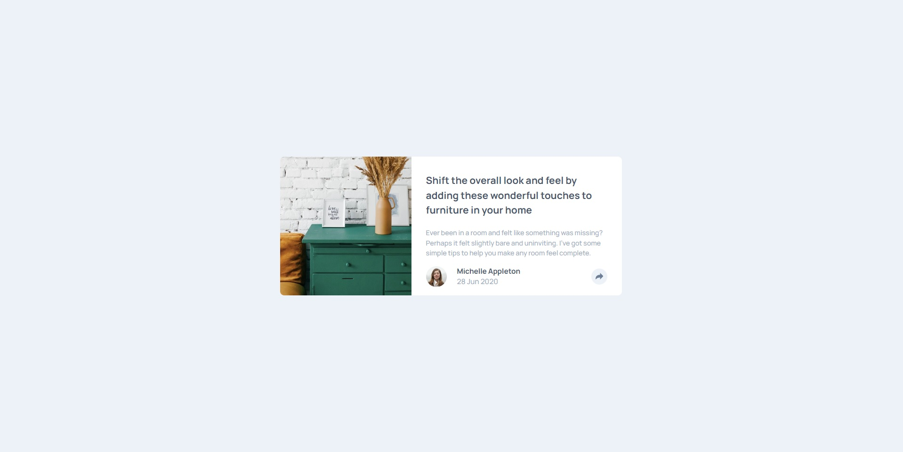

# Frontend Mentor - Article preview component solution

This is a solution to the [Article preview component challenge on Frontend Mentor](https://www.frontendmentor.io/challenges/article-preview-component-dYBN_pYFT). Frontend Mentor challenges help you improve your coding skills by building realistic projects.

## Table of contents

- [Overview](#overview)
  - [The challenge](#the-challenge)
  - [Screenshot](#screenshot)
  - [Links](#links)
- [My process](#my-process)
  - [Built with](#built-with)
- [Author](#author)

## Overview

### The challenge

Users should be able to:

- It has been a challenge to create the active state for share button.
  I've tried to use Tailwindcss to everything, but some things I had to use vanilla css.

### Screenshot

### Links

- Solution URL: [GitHub](https://github.com/marquesfelip/article-preview-component)
- Live Site URL: [Cloudflare](https://article-preview-component-am7.pages.dev/)

## My process

### Built with

- Semantic HTML5 markup
- CSS custom properties
- Flexbox
- Mobile-first workflow
- [TailwindCSS](https://tailwindcss.com/)

## Author

- GitHub - [marquesfelip](https://github.com/marquesfelip)
- Frontend Mentor - [@marquesfelip](https://www.frontendmentor.io/profile/marquesfelip)
- LinkedIn - [Felipe Marques](https://www.linkedin.com/in/felipemarquessouza/)
